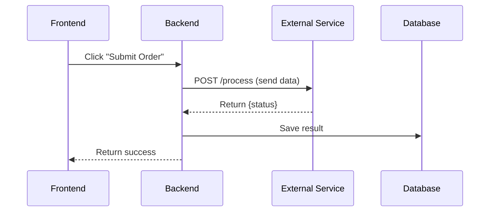
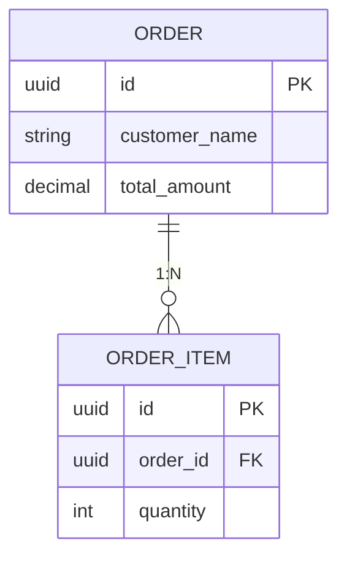
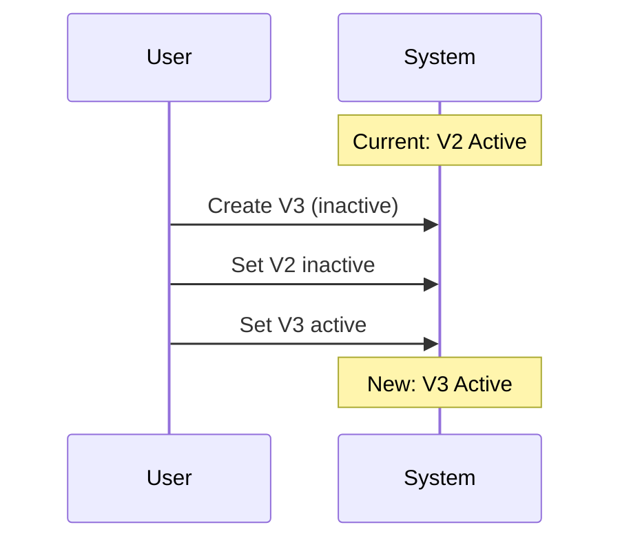

# Meeting Minutes Taker

Transform raw meeting transcripts into comprehensive, evidence-based meeting minutes through iterative review.

## Quick Start

1. Read the transcript provided by user
2. Load project-specific context file if provided by user (optional)
3. **Multi-turn generation**: Use multiple passes or subagents with isolated context, merge using UNION
4. Self-review using [references/completeness_review_checklist.md](references/completeness_review_checklist.md)
5. Present draft to user for human line-by-line review
6. **Cross-AI comparison** (optional): Human may provide output from other AI tools (e.g., Gemini, ChatGPT) - merge to reduce bias
7. Iterate on feedback until human approves final version

## Core Workflow

Copy this checklist and track progress:

```
Meeting Minutes Progress:
- [ ] Step 1: Read and analyze transcript
- [ ] Step 2: Multi-turn generation (PARALLEL subagents with Task tool)
  - [ ] Create transcript-specific dir: <output_dir>/intermediate/<transcript-name>/
  - [ ] Launch 3 Task subagents IN PARALLEL (single message, 3 Task tool calls)
    - [ ] Subagent 1 → <output_dir>/intermediate/<transcript-name>/version1.md
    - [ ] Subagent 2 → <output_dir>/intermediate/<transcript-name>/version2.md
    - [ ] Subagent 3 → <output_dir>/intermediate/<transcript-name>/version3.md
  - [ ] Merge: UNION all versions, AGGRESSIVELY include ALL diagrams → draft_minutes.md
  - [ ] Final: Compare draft against transcript, add omissions
- [ ] Step 3: Self-review for completeness
- [ ] Step 4: Present draft to user for human review
- [ ] Step 5: Cross-AI comparison (if human provides external AI output)
- [ ] Step 6: Iterate on human feedback (expect multiple rounds)
- [ ] Step 7: Human approves final version

Note: <output_dir> = directory where final meeting minutes will be saved (e.g., project-docs/meeting-minutes/)
Note: <transcript-name> = name derived from transcript file (e.g., 2026-01-15-product-api-design)
```

### Step 1: Read and Analyze Transcript

Analyze the transcript to identify:
- Meeting topic and attendees
- Key decisions with supporting quotes
- Action items with owners
- Deferred items / open questions

### Step 2: Multi-Turn Initial Generation (Critical)

**A single pass will absolutely lose content.** Use multi-turn generation with **redundant complete passes**:

#### Core Principle: Multiple Complete Passes + UNION Merge

Each pass generates **COMPLETE minutes (all sections)** from the full transcript. Multiple passes with isolated context catch different details. UNION merge consolidates all findings.

**❌ WRONG: Narrow-focused passes** (wastes tokens, causes bias)
```
Pass 1: Only extract decisions
Pass 2: Only extract action items
Pass 3: Only extract discussion
```

**✅ CORRECT: Complete passes with isolated context**
```
Pass 1: Generate COMPLETE minutes (all sections) → version1.md
Pass 2: Generate COMPLETE minutes (all sections) with fresh context → version2.md
Pass 3: Generate COMPLETE minutes (all sections) with fresh context → version3.md
Merge: UNION all versions, consolidate duplicates → draft_minutes.md
```

#### Strategy A: Sequential Multi-Pass (Complete Minutes Each Pass)

```
Pass 1: Read transcript → Generate complete minutes → Write to: <output_dir>/intermediate/version1.md
Pass 2: Fresh context → Read transcript → Generate complete minutes → Write to: <output_dir>/intermediate/version2.md
Pass 3: Fresh context → Read transcript → Generate complete minutes → Write to: <output_dir>/intermediate/version3.md
Merge: Read all versions → UNION merge (consolidate duplicates) → Write to: draft_minutes.md
Final: Compare draft against transcript → Add any remaining omissions → final_minutes.md
```

#### Strategy B: Parallel Multi-Agent (Complete Minutes Each Agent) - PREFERRED

**MUST use the Task tool** to spawn multiple subagents with **isolated context**, each generating **complete minutes**:

**Implementation using Task tool:**
```
// Launch ALL 3 subagents in PARALLEL (single message, multiple Task tool calls)
Task(subagent_type="general-purpose", prompt="Generate complete meeting minutes from transcript...", run_in_background=false) → version1.md
Task(subagent_type="general-purpose", prompt="Generate complete meeting minutes from transcript...", run_in_background=false) → version2.md
Task(subagent_type="general-purpose", prompt="Generate complete meeting minutes from transcript...", run_in_background=false) → version3.md

// After all complete:
Main Agent: Read all versions → UNION merge, consolidate duplicates → draft_minutes.md
```

**CRITICAL: Subagent Prompt Must Include:**
1. Full path to transcript file
2. Full path to output file (version1.md, version2.md, version3.md in transcript-specific subdirectory)
3. Context files to load (project-specific context if provided, meeting_minutes_template.md)
4. Reference images/documents if provided by user
5. Output language requirement (match user's language preference, preserve technical terms in English)
6. Quote formatting requirement (see Quote Formatting Requirements section below)

**Why multiple complete passes work:**
- Each pass independently analyzes the SAME content
- Different context states catch different details (no single pass catches everything)
- Pass 1 might catch decision X but miss action item Y
- Pass 2 might catch action item Y but miss decision X
- UNION merge captures both X and Y

**Why isolated context matters:**
- Each pass/agent starts fresh without prior assumptions
- No cross-contamination between passes
- Different "perspectives" emerge naturally from context isolation

#### Progressive Context Offloading (Use File System)

**Critical: Write each pass output to files, not conversation context.**

**Path Convention:** All intermediate files should be created in a **transcript-specific subdirectory** under `<output_dir>/intermediate/` to avoid conflicts between different transcripts being processed.

**CRITICAL: Use transcript-specific subdirectory structure:**
```
<output_dir>/intermediate/<transcript-name>/version1.md
<output_dir>/intermediate/<transcript-name>/version2.md
<output_dir>/intermediate/<transcript-name>/version3.md
```

Example: If final minutes will be `project-docs/meeting-minutes/2026-01-14-api-design.md`, then:
- Intermediate files: `project-docs/meeting-minutes/intermediate/2026-01-14-api-design/version1.md`
- This prevents conflicts when multiple transcripts are processed in the same session
- The `intermediate/` folder should be added to `.gitignore` (temporary working files)

```
// Create transcript-specific subdirectory first
mkdir: <output_dir>/intermediate/<transcript-name>/

// Launch all 3 subagents IN PARALLEL (must be single message with 3 Task tool calls)
Task 1 → Write to: <output_dir>/intermediate/<transcript-name>/version1.md (complete minutes)
Task 2 → Write to: <output_dir>/intermediate/<transcript-name>/version2.md (complete minutes)
Task 3 → Write to: <output_dir>/intermediate/<transcript-name>/version3.md (complete minutes)

Merge Phase:
  Read: <output_dir>/intermediate/<transcript-name>/version1.md
  Read: <output_dir>/intermediate/<transcript-name>/version2.md
  Read: <output_dir>/intermediate/<transcript-name>/version3.md
  → UNION merge, consolidate duplicates, INCLUDE ALL DIAGRAMS → Write to: draft_minutes.md

Final Review:
  Read: draft_minutes.md
  Read: original_transcript.md
  → Compare & add omissions → Write to: final_minutes.md
```

**Benefits of file-based context offloading:**
- Conversation context stays clean (avoids token overflow)
- Intermediate results persist (can be re-read if needed)
- Each pass starts with fresh context window
- Merge phase reads only what it needs
- **Human can inspect intermediate files for review** - Critical for understanding what each pass captured
- Supports very long transcripts that exceed context limits
- **Enables post-hoc debugging** - If final output is missing something, human can trace which pass missed it

**IMPORTANT: Always preserve intermediate versions in transcript-specific subdirectory:**
- `<output_dir>/intermediate/<transcript-name>/version1.md`, `version2.md`, `version3.md` - Each subagent output
- These files help human reviewers understand the merge process
- Do NOT delete intermediate files after merge
- Human may want to compare intermediate versions to understand coverage gaps
- **Add `intermediate/` to `.gitignore`** - These are temporary working files, not final deliverables
- **Transcript-specific subdirectory** prevents conflicts when processing multiple transcripts

#### Output Requirements

- **Chinese output** with English technical terms preserved
- **Evidence-based decisions** - Every significant decision needs a supporting quote
- **Structured sections** - Executive Summary, Key Decisions, Discussion, Action Items, Parking Lot
- **Proper quote formatting** - See Quote Formatting Requirements section below
- **Mermaid diagrams** (STRONGLY ENCOURAGED) - Visual diagrams elevate minutes beyond pure text:
  - **ER diagrams** for database/schema discussions
  - **Sequence diagrams** for data flow and API interactions
  - **Flowcharts** for process/workflow decisions
  - **State diagrams** for state machine discussions
  - Diagrams make minutes significantly easier for humans to review and understand
- **Context-first document structure** - Place all reviewed artifacts (UI mockups, API docs, design images) at the TOP of the document (after metadata, before Executive Summary) to establish context before decisions; copy images to `assets/<meeting-name>/` folder and embed inline using `` syntax; include brief descriptions with the visuals - this creates "next level" human-readable minutes where readers understand what was discussed before reading the discussion
- **Speaker attribution** - Correctly attribute decisions to speakers

#### Key Rules

- Never assume - Ask user to confirm if unclear
- Quote controversial decisions verbatim
- Assign action items to specific people, not teams
- Preserve numerical values (ranges, counts, priorities)
- **Always use multiple passes** - Single turn is guaranteed to lose content
- **Normalize equivalent terminology** - Treat trivial variations (e.g., "backend architecture" vs "backend", "API endpoint" vs "endpoint") as equivalent; do NOT point out or highlight such differences between speakers
- **Single source of truth** - Place each piece of information in ONE location only; avoid duplicating tables, lists, or summaries across sections (e.g., API list belongs in Discussion OR Reference, not both)

### Step 3: Self-Review for Completeness

After initial generation, immediately review against transcript:

```
Completeness Checklist:
- [ ] All discussion topics covered?
- [ ] All decisions have supporting quotes?
- [ ] All speakers attributed correctly?
- [ ] All action items have specific owners?
- [ ] Numerical values preserved (ranges, counts)?
- [ ] Entity relationships captured?
- [ ] State machines complete (all states listed)?
```

If gaps found, add missing content silently without mentioning what was missed.

### Step 4: Present to User for Human Review

Present the complete minutes as a **draft for human review**. Emphasize:
- Minutes require careful line-by-line human review
- Domain experts catch terminology conflicts AI may miss
- Final version emerges through iterative refinement

User may:
- Accept as-is (rare for complex meetings)
- Request deeper review for missing content
- Identify terminology issues (e.g., naming conflicts with existing systems)
- Provide another AI's output for cross-comparison

### Step 5: Cross-AI Comparison (Reduces Bias)

**When human provides output from another AI tool** (e.g., Gemini, ChatGPT, etc.):

This step is valuable because:
- **Different AI models have different biases** - Each AI catches different details
- **Cross-validation** - Content appearing in both outputs is likely accurate
- **Gap detection** - Content in one but not the other reveals potential omissions
- **Error correction** - One AI may catch factual errors the other missed (e.g., wrong date, wrong attendee name)

**Comparison Process:**
1. Read the external AI output carefully
2. Identify items present in external output but missing from our draft
3. Verify each item against original transcript before adding (don't blindly copy)
4. Identify items where external AI has errors (wrong facts) - note but don't copy errors
5. UNION merge valid new content into our draft
6. Document any corrections made based on cross-comparison

**Example findings from cross-AI comparison:**
- Missing decision about API authentication method ✓ (add to our draft)
- Missing naming convention specification ✓ (add to our draft)
- Wrong date (2026-01-13 vs actual 2026-01-14) ✗ (don't copy error)
- Wrong attendee name ✗ (don't copy error)
- Missing database performance concern ✓ (add to parking lot)

### Step 6: Iterate on Human Feedback (Critical)

**When user requests deeper review** ("deep review", "check again", "anything missing"):

1. Re-read transcript section by section
2. Compare each section against current minutes
3. Look for: entities, field names, numerical ranges, state transitions, trade-offs, deferred items
4. Add any omitted content
5. Never claim "nothing missing" without thorough section-by-section review

**When user provides another version to merge:**

Merge Principle: **UNION, never remove**

1. Keep ALL content from existing version
2. Add ALL new content from incoming version
3. Consolidate duplicates (don't repeat same info)
4. Preserve more detailed version when depth differs
5. Maintain logical section numbering

### Aggressive Diagram Inclusion (CRITICAL)

**During merge phase, MUST aggressively include ALL diagrams from ALL versions.**

Diagrams are high-value content that took effort to generate. Different subagents may produce different diagrams based on what they focused on. Missing a diagram during merge is a significant loss.

**Merge diagram strategy:**
1. **Inventory ALL diagrams** from each version (v1, v2, v3)
2. **Include ALL unique diagrams** - don't assume a diagram is redundant
3. **If similar diagrams exist**, keep the more detailed/complete one
4. **Check every section** that could contain diagrams: Executive Summary, Discussion, API design, State machines, Data flow, etc.

**Common diagram types to look for:**
- Sequence diagrams (data flow, API interactions)
- ER diagrams (database schema, table relationships)
- State diagrams (state machines, status transitions)
- Flowcharts (decision flows, process workflows)
- Component diagrams (system architecture)

**Example: Missed diagram from v3**
If v3 has a flowchart for "Status Query Mechanism" but v1/v2 don't have it, that flowchart MUST appear in the merged output. Don't assume it's covered by other diagrams.

## Output Language

- **Primary:** Match the language of the transcript (or user's preference if specified)
- **Preserve in English:** Technical terms, entity names, abbreviations (standard practice)
- **Quotes:** Keep original language from transcript

## Reference Files

| File | When to Load |
|------|--------------|
| [meeting_minutes_template.md](references/meeting_minutes_template.md) | First generation - Contains template structure |
| [completeness_review_checklist.md](references/completeness_review_checklist.md) | During review steps - Contains completeness checks |
| Project context file (user-provided) | When user provides project-specific context (team directory, terminology, conventions) |

## Common Patterns

### Architecture Discussions → Mermaid Diagrams (Next-Level Minutes)

**Diagrams elevate meeting minutes beyond pure text.** They make complex discussions immediately understandable for human reviewers. Always look for opportunities to add visual diagrams.

#### When to Use Diagrams:
- **Data flow discussions** → Sequence diagram
- **Database schema discussions** → ER diagram
- **Process/workflow decisions** → Flowchart
- **State machine discussions** → State diagram
- **System architecture** → Component diagram

#### Example: Data Flow (Sequence Diagram)



#### Example: Database Schema (ER Diagram)



#### Example: Version Switching (Workflow Diagram)



### Quote Formatting Requirements (CRITICAL)

**Quotes MUST use proper markdown blockquote format on separate lines:**

**❌ WRONG: Inline quote format**
```markdown
* **Quote:** > "This is wrong" - **Speaker**
```

**✅ CORRECT: Blockquote on separate lines**
```markdown
* **Quote:**
  > "This is the correct format" - **Speaker**
```

**✅ CORRECT: Multiple quotes**
```markdown
* **Quote:**
  > "First quote from the discussion" - **Speaker1**
  > "Second quote supporting the same decision" - **Speaker2**
```

**Key formatting rules:**
- `* **Quote:**` on its own line (no quote content on this line)
- Blank line NOT needed after `* **Quote:**`
- Quote content indented with 2 spaces, then `> ` prefix
- Speaker attribution at end of quote line: `- **SpeakerName**`
- Multiple quotes use same indentation, each on its own line

### Technical Decisions → Decision Block

```markdown
### 2.X [Category] Decision Title

* **Decision:** Specific decision made
* **Logic:**
  * Reasoning point 1
  * Reasoning point 2
* **Quote:**
  > "Exact quote from transcript" - **Speaker Name**
```

### Deferred Items → Parking Lot

Items with keywords like "defer to later", "Phase 2", "not in MVP" go to Parking Lot with context.

## Human-in-the-Loop Iteration (Essential)

Meeting minutes are **not one-shot outputs**. High-quality minutes emerge through multiple review cycles:

### Why Human Review is Critical

1. **Terminology conflicts**: Humans know existing system naming (e.g., "Note" already means comments in the existing system)
2. **Domain context**: Humans catch when a term could be confused with another (e.g., "UserProfile" vs "Account")
3. **Organizational knowledge**: Humans know team conventions and prior decisions
4. **Completeness gaps**: Humans can request "deep review" review when something feels missing

### Example Iteration Pattern

```
Round 1: Initial generation
  └─ Human review: "Check original transcript for missing items"
Round 2: Deep transcript review, add omitted content
  └─ Human review: "UserProfile conflicts with existing Account entity naming"
Round 3: Update terminology to use "CustomerProfile" instead
  └─ Human review: "Note field conflicts with existing Comment system"
Round 4: Update to use "Annotation" instead of "Note"
  └─ Human approval: Final version ready
```

### Key Principle

**The AI generates the first draft; humans refine to the final version.** Never assume the first output is complete or uses correct terminology. Always encourage human review and be ready for multiple iteration cycles.

## Anti-Patterns

- ❌ **Single-pass generation** - One turn through transcript will absolutely lose content
- ❌ **Divided sections without overlap** - Each pass must cover FULL transcript, not split by sections
- ❌ **Narrow-focused passes** - Each pass must generate COMPLETE minutes (all sections), not just one section type (wastes tokens, causes bias)
- ❌ Generic summaries without supporting quotes
- ❌ Action items assigned to "team" instead of specific person
- ❌ Missing numerical values (priorities, ranges, state counts)
- ❌ State machines with incomplete states
- ❌ Circular debate transcribed verbatim instead of summarized
- ❌ Removing content during multi-version merge
- ❌ Claiming "nothing missing" without section-by-section review
- ❌ Treating first draft as final without human review
- ❌ Using terminology without checking for conflicts with existing systems
- ❌ Shared context between subagents (causes cross-contamination and missed content)
- ❌ Keeping all intermediate outputs in conversation context (causes token overflow, use file system)
- ❌ **Pure text minutes without diagrams** - Architecture/schema discussions deserve visual representation
- ❌ **Deleting intermediate files after merge** - Preserve for human review and debugging
- ❌ **Blindly copying external AI output** - Always verify against transcript before merging
- ❌ **Ignoring cross-AI comparison opportunity** - Different AI models catch different details
- ❌ **Sequential subagent execution** - MUST launch v1, v2, v3 subagents in PARALLEL using multiple Task tool calls in a single message
- ❌ **Flat intermediate directory** - MUST use transcript-specific subdirectory `intermediate/<transcript-name>/` to avoid conflicts
- ❌ **Inline quote formatting** - Quotes MUST use blockquote format on separate lines, not inline `> "quote"`
- ❌ **Omitting diagrams during merge** - MUST aggressively include ALL diagrams from ALL versions, even if they seem similar
- ❌ **Highlighting trivial terminology variations** - Do NOT point out differences like "backend architecture" vs "backend" or "API" vs "endpoint" between speakers; these are equivalent terms and highlighting such differences is disrespectful
- ❌ **Duplicate content across sections** - Do NOT repeat the same information in multiple sections (e.g., API endpoint table in both "Discussion" and "Reference"); place content in ONE authoritative location and reference it if needed
- ❌ **Creating non-existent links** - Do NOT create markdown links to files that don't exist in the repo (e.g., `[doc.md](reviewed-document)`); use plain text for external/local documents not in the repository
- ❌ **Losing content during consolidation** - When moving or consolidating sections, verify ALL bullet points and details are preserved; never summarize away specific details like "supports batch operations" or "button triggers auto-save"
- ❌ **Appending domain details to role titles** - Use ONLY the Role column from Team Directory for speaker attribution (e.g., "Backend", "Frontend", "TPM"); do NOT append specializations like "Backend, Infrastructure" or "Backend, Business Logic" - all team members with the same role should have identical attribution
