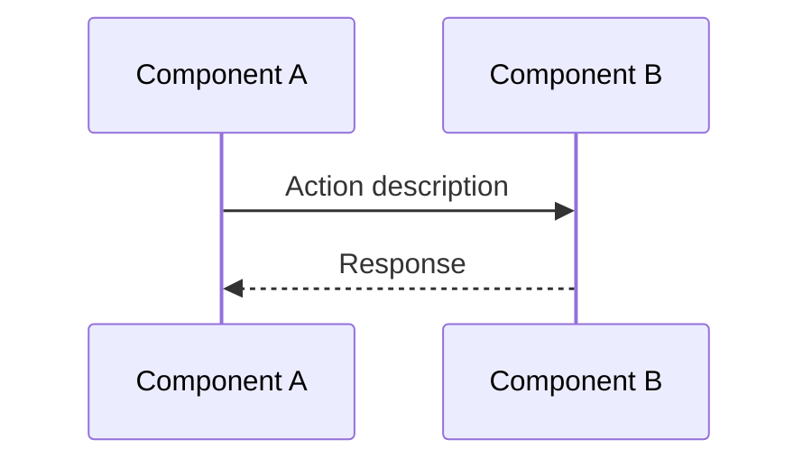

# Meeting Minutes Template

## Meeting Metadata

```markdown
---
title: [Meeting Title]
date: [YYYY-MM-DD]
attendees:
  - Name (Role)
  - Name (Role)
duration: [X hours/minutes]
location: [Virtual/Room Name]
---
```

## Document Structure

### 1. Executive Summary

Brief 2-3 sentence overview of what was discussed and decided.

### 2. Reviewed Materials (Optional)

If the meeting reviewed specific documents, mockups, or artifacts, list them here with brief descriptions. Include images inline if available.

```markdown

```

### 3. Key Decisions

For each major decision:

```markdown
### 3.X [Category] Decision Title

* **Decision:** Specific decision made
* **Logic:**
  * Reasoning point 1
  * Reasoning point 2
* **Quote:**
  > "Exact quote from transcript supporting this decision" - **Speaker Name**
```

Categories: Architecture, API Design, Data Model, Process, Security, etc.

### 4. Discussion Details

Detailed breakdown by topic. Include:
- Context and background
- Options considered
- Trade-offs discussed
- Final direction

Use Mermaid diagrams where applicable:



### 5. Action Items

| # | Task | Owner | Priority | Due Date |
|---|------|-------|----------|----------|
| 1 | Task description | Person Name | P1/P2/P3 | YYYY-MM-DD |

### 6. Parking Lot (Deferred Items)

Items explicitly deferred to future phases or follow-up discussions:

| Item | Reason Deferred | Follow-up |
|------|-----------------|-----------|
| Feature X | Out of MVP scope | Phase 2 |
| Decision Y | Needs more research | Offline discussion |

### 7. Open Questions

Unresolved questions that need follow-up:

- Question 1 - Owner to investigate
- Question 2 - Pending external input

---

## Formatting Guidelines

### Quote Format (CRITICAL)

Always use blockquote on separate line:

```markdown
* **Quote:**
  > "This is the correct format" - **Speaker Name**
```

NOT inline:
```markdown
* **Quote:** > "This is wrong" - **Speaker**
```

### Speaker Attribution

Use consistent role-based attribution throughout:
- **Backend**, **Frontend**, **PM**, **TPM**, **Designer**, etc.

### Technical Terms

Preserve in English: API names, entity names, technical terminology, abbreviations

### Diagrams

Use Mermaid for:
- Sequence diagrams (data flow)
- ER diagrams (data models)
- Flowcharts (processes)
- State diagrams (state machines)
