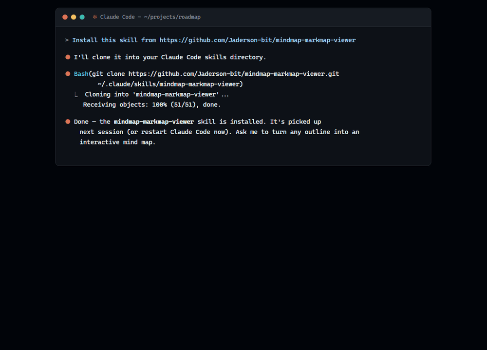

# mindmap-markmap-viewer

A Claude Code skill that turns hierarchical Markdown into an **interactive SVG mind map** with [markmap.js](https://markmap.js.org/) — readable white-on-dark by default, with expand-by-level control and a search that filters the tree to matches **plus their ancestors and descendants** (so a hit always shows up in context, not floating alone). Works standalone or embedded in Streamlit.



**[▶ Live demo](https://jaderson-bit.github.io/mindmap-markmap-viewer/)** — an actual generated map, in your browser: pan, zoom, fold branches, export SVG/PNG. The page is one self-contained HTML file, exactly what the skill produces.

## Try it in one line

No install needed — paste this into Claude (Claude Code or the app):

> Using this skill https://github.com/Jaderson-bit/mindmap-markmap-viewer, create a mindmap of Product Management.

Claude clones the skill on the fly, follows its authoring rules (balanced branches, short labels), and hands back an interactive `.html` that opens offline plus the editable `.md` source of truth. Swap "Product Management" for anything you want mapped.

## Why this exists

markmap renders a Markdown outline as a zoomable mind map, but three things need a layer on top to be genuinely usable:

- **Visibility** — a white font is invisible on the white default surface; the renderer paints its own dark backdrop so the map is readable everywhere, not just in a dark host.
- **Expand control** — collapse to N levels or expand everything, without rebuilding the map.
- **Search that keeps context** — filtering to just the matching nodes loses the path that explains *where* a hit lives; this keeps ancestors and the matched subtree.

## Features

- One call to a **single self-contained HTML file** (`build_html` / `write_mindmap`) — the markmap stack (vendored locally and pinned exact) is **inlined into the page**, so the one `.html` **opens offline anywhere** with no CDN, no network, and no sibling files to keep alongside it.
- Built-in **navigation toolbar**: zoom in/out, fit-to-window, expand-all / collapse-all, and **export to SVG / PNG** (2× raster, current fold state).
- Expand-by-level (`set_expand_level`), including expand-all (`-1`).
- Accent-insensitive, context-preserving search (`filter_markmap`).
- HTML-safe: `<`, `>`, `&` in node text (`List<String>`, `a < b`) round-trip correctly instead of breaking the page.
- **Zero runtime dependencies** for the core — Python standard library only. Streamlit is an optional import, used only when you embed.

## Install

Ask Claude Code to install it from this repo:

> Install this skill from https://github.com/Jaderson-bit/mindmap-markmap-viewer

Or, as a developer, clone it into your skills directory:

```bash
git clone https://github.com/Jaderson-bit/mindmap-markmap-viewer.git ~/.claude/skills/mindmap-markmap-viewer
```

Or copy a folder you already have:

```bash
cp -r mindmap-markmap-viewer ~/.claude/skills/
```

## Usage

```python
import sys
from pathlib import Path

SKILL = Path.home() / ".claude" / "skills" / "mindmap-markmap-viewer"  # wherever you cloned it
sys.path.insert(0, str(SKILL / "scripts"))
from render_markmap import build_html, set_expand_level, filter_markmap

src = (SKILL / "assets" / "example.md").read_text(encoding="utf-8")   # or your own outline
# optional: src, n = filter_markmap(src, "branch b")   # search + keep context
# optional: src = set_expand_level(src, -1)             # expand all
open("mindmap.html", "w", encoding="utf-8").write(build_html(src, height=850))
```

Inside Streamlit:

```python
sys.path.insert(0, str(SKILL / "scripts"))             # SKILL as above
from render_markmap import render_markmap, set_expand_level
render_markmap(set_expand_level(src, 2), height=850)
```

See [`SKILL.md`](SKILL.md) for the source format and authoring rules.

## Layout

```
mindmap-markmap-viewer/
├── SKILL.md                     # operational guide (loads when the skill triggers)
├── scripts/render_markmap.py    # build_html / set_expand_level / filter_markmap
├── assets/
│   ├── example.md               # minimal sample outline
│   └── vendor/                  # pinned markmap + d3 libs, loaded locally (offline)
├── evals/                       # dependency-free regression suite + eval prompts
└── references/
    ├── internals.md             # how the helpers work and why
    └── lessons.md               # real-world lessons + adversarial counter-review
```

## Tests

```bash
python evals/test_render_markmap.py
```

A dependency-free suite; every check is labeled with the bug it locks down.

## Battle-tested

The renderer and text transforms were hardened against a multi-agent adversarial review (12 confirmed findings, each verified by a second agent that tried to refute it). The findings — and the process — are documented in [`references/lessons.md`](references/lessons.md).
